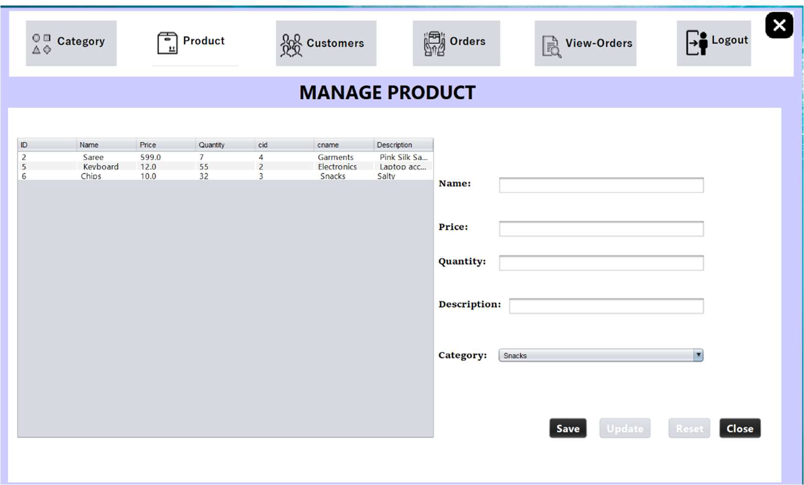
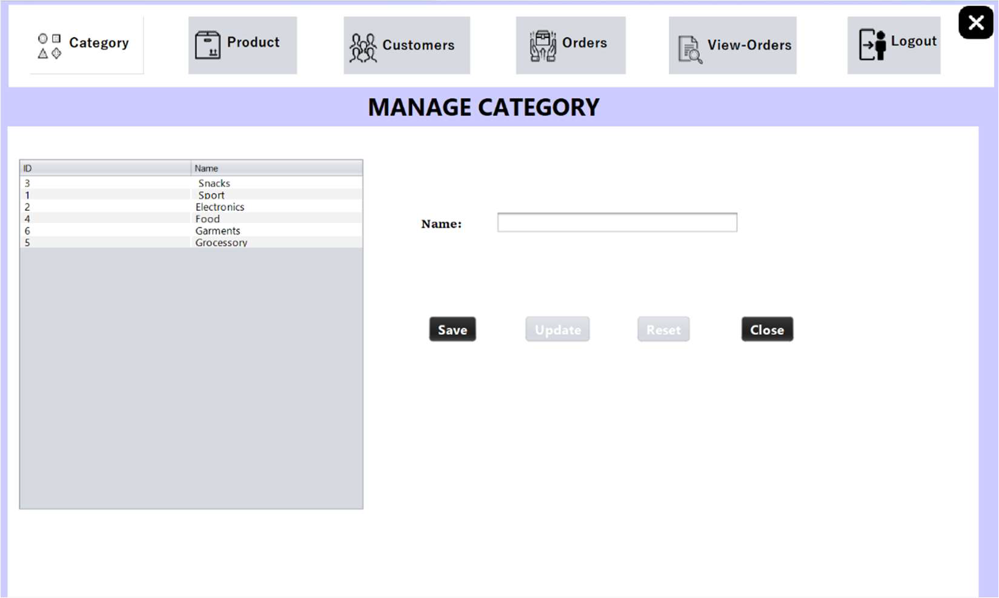
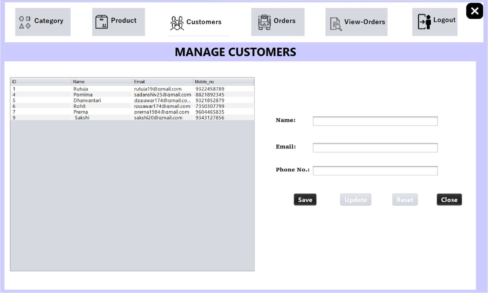
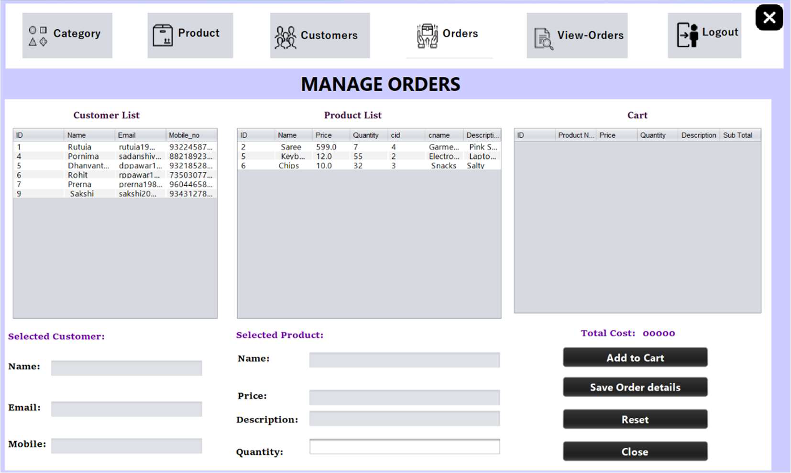
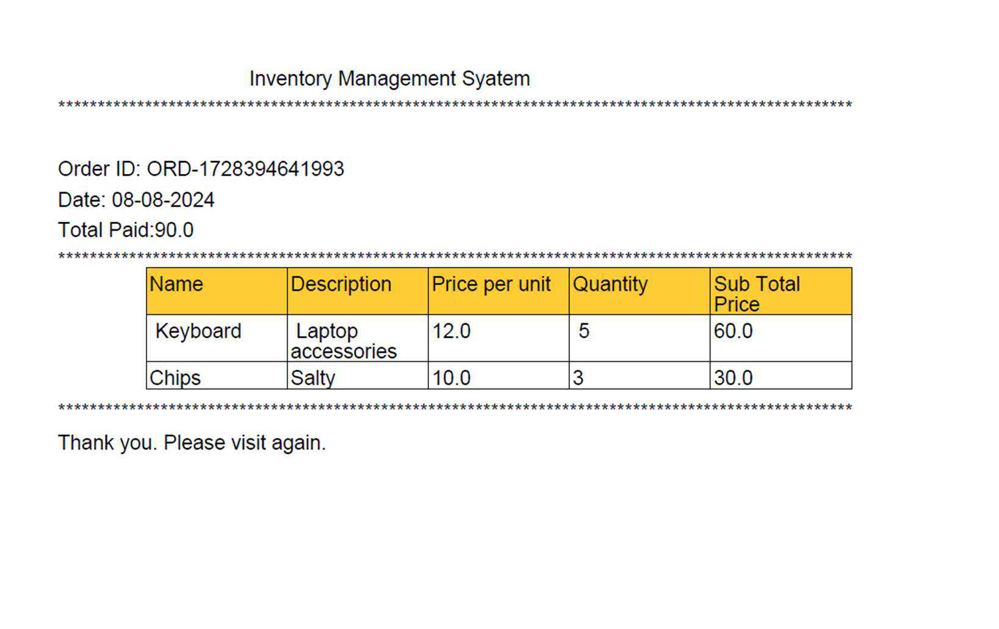

# Inventory-Managemenat-System
This is a Java application bulit using JFrame, Swing, AWT, MYSQL JDBC Connection. 
📄 Documentation Structure
# 1. Project Overview
The primary objective of this project is to create a centralized database that stores detailed
information on products, customers, suppliers, sales, and purchase orders. By utilizing a
DBMS, businesses can automate and simplify inventory tasks, reducing manual errors,
improving decision-making, and enhancing operational efficiency. The system will allow realtime
updates to inventory, ensuring data consistency and availability for users.
This project ensures product management to keep track of product details like item name,
description, categories and a unique identification number for each product. It maintains the
information of the supplier and the customer along with the transaction history. This project
also maintains a summary report of every transaction and generates invoice as a part of
transaction record.

# 2. Features
The Inventory Management System project involves various functionalities and
features as listed below.
### 1. Admin Registration
- Enables system administrator to register to the system
- Log in using credentials.
- Admin can add suppliers to the system.
- Set supplier status so that only active users can access the
functionalities.
### 2. Supplier Registration
- Supplier registration and login through credentials provided by the
admin.
- Supplier can add customers and their information
### 3. Product Functionalities
- Add Product details name, price, quantity, description and category.
- Save, Update or Reset product information.
- Show Product details.
### 4. Category Functionalities
- Add Category of Product.
- Select Product category using category name.
### 5. Customer Functionalities
- Add customer information name, phone and email address.
- Save, Update, Reset customer details.
### 6. View Orders Functionality
- View order summary.
- Display list of customers along with order summary.
### 7. Order Management
- Enables to search a customer by name, contact or email address.
- Gives product details for customer.
- Display cart and enables adding and removing items from cart and
saving order details to generate invoice.

# 3. System Requirements
## Hardware
System with minimum 4GB RAM and at least 2GHz processor.
## Software
- Operating System- Windows 10 or greater
- Database Management System- MYSQL
- Integrated Development Environment (IDE)- NetBeans
- Programming Language- Java (JDBC connectivity)
- Database Query Tools- MYSQL Workbench

# 4. Architecture Overview
System workflow

Role-based access

Integration of Java Swing frontend and MySQL backend

# 5. Database Design
## ER Diagram 

## Relational Schema 
Key Tables
1. Admin
2. User/ Supplier
3. Customer
4. Product
5. Category
6. Order
7. Cart
8. Invoice

## Database Schema
### 1. Admin

| Column Name | Data Type   | Constraints      | Description                |
| ----------- | ----------- | ---------------- | -------------------------- |
| Email       | VARCHAR(50) | UNIQUE, NOT NULL | Unique identifier          |
| Password    | VARCHAR(20) | NOT NULL         | User’s password for access |

### 2. User / Supplier

| Column Name | Data Type    | Constraints                  | Description                |
| ----------- | ------------ | ---------------------------- | -------------------------- |
| User Id     | INT          | PRIMARY KEY, AUTO\_INCREMENT | Unique identifier for user |
| Name        | VARCHAR(50)  | NOT NULL                     | User’s login name          |
| Mobile No   | VARCHAR(10)  | UNIQUE, NOT NULL             | User’s contact             |
| Email       | VARCHAR(50)  | UNIQUE, NOT NULL             | User’s email address       |
| Address     | VARCHAR(100) | NOT NULL                     | User’s postal address      |

### 3. Customer
| Column Name | Data Type   | Constraints                   | Description        |
| ----------- | ----------- | ----------------------------- | ------------------ |
| Customer Id | INT         | PRIMARY KEY, UNIQUE, NOT NULL | Unique identifier  |
| Name        | VARCHAR(50) | NOT NULL                      | Customer’s name    |
| Email       | VARCHAR(50) | UNIQUE, NOT NULL              | Customer’s email   |
| Mobile No   | VARCHAR(10) | UNIQUE, NOT NULL              | Customer’s contact |

### 4. Product
| Column Name | Data Type   | Constraints                   | Description       |
| ----------- | ----------- | ----------------------------- | ----------------- |
| Product Id  | INT         | PRIMARY KEY, UNIQUE, NOT NULL | Unique identifier |
| Name        | VARCHAR(50) | NOT NULL                      | Product name      |
| Quantity    | INT         | NOT NULL                      | Product quantity  |
| Price       | INT         | NOT NULL                      | Product price     |

### 5. Category
| Column Name | Data Type   | Constraints                   | Description       |
| ----------- | ----------- | ----------------------------- | ----------------- |
| Category Id | INT         | PRIMARY KEY, UNIQUE, NOT NULL | Unique identifier |
| Name        | VARCHAR(50) | NOT NULL                      | Category name     |

### 6. Order
| Column Name | Data Type | Constraints                   | Description       |
| ----------- | --------- | ----------------------------- | ----------------- |
| Order Id    | INT       | PRIMARY KEY, UNIQUE, NOT NULL | Unique identifier |

### 7. Cart
| Column Name  | Data Type   | Constraints             | Description                               |
| ------------ | ----------- | ----------------------- | ----------------------------------------- |
| Product      | VARCHAR(50) | COMPOSITE KEY, NOT NULL | Unique identifier for weak entity         |
| Price        | INT         | NOT NULL                | Price of each product                     |
| Quantity     | INT         | NOT NULL                | Total number of products                  |
| Total Amount | INT         | NOT NULL                | Total amount for given number of products |

### 8.Invoice
| Column Name    | Data Type   | Constraints | Description                 |
| -------------- | ----------- | ----------- | --------------------------- |
| Id             | INT         | PRIMARY KEY | Unique identifier           |
| Product Name   | VARCHAR(50) | NOT NULL    | Name of product             |
| Price per unit | INT         | NOT NULL    | Price of each product       |
| Quantity       | INT         | NOT NULL    | Number of products          |
| Amount         | INT         | NOT NULL    | Total price of all products |
| Date           | DATE        | NOT NULL    | Date of transaction         |

# 7. Relationships
- Admin Supplier: Admin can add multiple suppliers (One to Many)
- Supplier Customer: One supplier can manage many Customers
(One to Many)
- Supplier Product: One supplier can manage many Products (One
to Many)
- Supplier Category: One supplier can manage many Categories of
Product (One to Many)
- Supplier Order: One supplier can place many Orders (One to
Many)
- Supplier Customer: One supplier can manage many Customers
(One to Many)
- Category Product: Many products can be of multiple categories
(Many to Many)
- Order Category: Multiple orders of multiple categories can be
selected (Many to Many)
- Order Customer: Many orders selected by many customers (Many
to Many)
- Order Product: Many products selected in many orders (Many to
Many)
- Order Cart: Multiple orders can be used to prepare in multiple
carts (Many to Many)
- Order Invoice: Each order will generate only one invoice on
payment (One to One)

# 8. Sample SQL Script
CREATE TABLE statements for all entities.

# 9. Normalization Explanation
### First Normal Form
All columns must contain atomic values. Each record should be unique.
 Admin
PK is combination of Admin Id and email
Admin table is in 1st Normal Form
 User/ Supplier
PK is combination of user id, phone and email
User/ Supplier table is in 1st Normal Form
 Product
PK is product id
Product table is in 1st Normal Form
 Customer
PK is combination of Customer id, email, phone
Customer table is in 1st Normal Form
 Order
PK is order id
Order table is in 1st Normal Form
 Invoice
PK is invoice id
Invoice table is in 1st Normal

### Second Normal Form
Table must be in 1st Normal Form and each non key attributes must depend on
the entire primary key
 Admin
Non key is name and password
Password: admin id, email
Admin (admin id, name)
Admin_Info (admin id, email, password)
 User/ Supplier
Non key is name, address
Name: user id
Address: user id
11
User (user id, name, address)
User_info (user id, phone, email)
 Product
All non-keys depend on product
 Customer
Customer (cust_id, name)
Cust_info (cust_id, email, phone)
 Order
Already in 2NF
 Invoice
Already in 2NF

### Third Normal Form
Every non-key depends on entire key. There should not be transitive
dependency.
 Admin
Admin (admin id, name)
Email password
Admin_info (admin id, email)
Admin_Email (email, password)
 User/ Supplier
User (user id, name, address)
User_mob (user_id, mobile no)
User_email (user_id, email)
 Product
Product (product_id, name, quantity, price, cat_id)
Category (cat_id, cat_name)
 Customer
Customer (cust_id, name)
Cust_Mob (cust_id, mobile_no)
Cust_Email (cust_id, email)
 Order
Already in 3NF
 Invoice
 Already in 3NF
### Boyce Codd Normal Form (BCNF)
Every attribute should be dependent on key, whole key. All tables are in BCNF

### Fourth Normal Form
Multivalued dependency in a table must be multivalued dependencies on the
key. All tables are in 4th normal form.
# 10. User Interface Overview
### Login Page

Registration Page

Product Page

Category Page

Customer Page

Order & Invoice Pages

# 11. Testing Summary
| Test Case ID | Test Case                               | Test Steps                                                                                                                    | Expected Result                                                                                                      | Actual Result                                           | Bugs Encountered | Status |
| ------------ | --------------------------------------- | ----------------------------------------------------------------------------------------------------------------------------- | -------------------------------------------------------------------------------------------------------------------- | ------------------------------------------------------- | ---------------- | ------ |
| **T01**      | Add product to cart                     | 1. Launch application   2. Select product from product list   3. Enter quantity   4. Click ‘Add to Cart’ button      | Product should be added to the cart and displayed in the cart table. Total amount should be updated.                 | “Product added successfully.”                           | No Bugs          | Pass   |
| **T02**      | Duplicate product handling              | 1. Add a product to the cart   2. Try to add the same product again                                                        | "Product is already in the cart!"                                                                                    | "Product is already in the cart!"                       | No Bugs          | Pass   |
| **T03**      | Update product quantity in the database | 1. Add a product to the cart   2. Save the order   3. Check the product quantity in the database after saving the order | Product quantity in the database should be reduced by the ordered quantity.                                          | Product quantity updated in the database                | No Bugs          | Pass   |
| **T04**      | Order saving functionality              | 1. Select a customer   2. Add products to the cart   3. Click on the "Save Order" button                                | Order should be saved successfully with an order ID generated. A PDF invoice should be created and the cart cleared. | Cart cleared after saving the order, invoice generated. | No Bugs          | Pass   |
| **T05**      | Generate PDF invoice                    | 1. Add products to the cart   2. Save the order   3. Check the PDF invoice generated                                    | A PDF invoice with correct order details should be generated and saved to the correct directory.                     | PDF generated with correct data                         | No Bugs          | Pass   |
